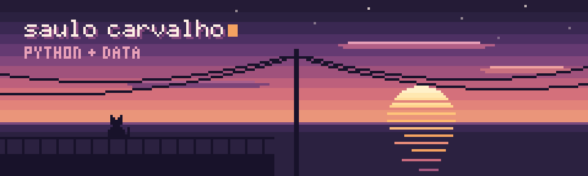
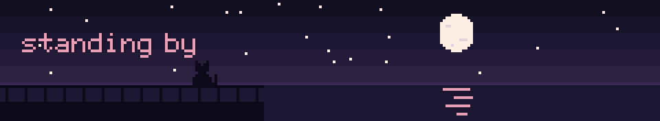

<p align="center">
  
</p>


<table>
<tr>
<td valign="top" width="55%">

Faço Ciência da Computação e estou focado em engenharia de dados.

Python é minha linguagem principal. Com Pandas e NumPy, limpo, transformo e analiso dados, e uso Jupyter para explorar antes de automatizar.

Estou aprendendo SQL e modelagem de dados, além de Docker para montar ambientes reproduzíveis.

Também desenvolvo para web com JavaScript e Node.js, e já trabalhei com Flutter e Firebase no mobile.

No dia a dia uso Linux, Git e o terminal, com zsh e tmux.

</td>
<td valign="top" width="45%">

```sql
SELECT curso, objetivo, estudando
FROM perfil
WHERE nome = 'Saulo Carvalho';

-- curso      Ciência da Computação
-- objetivo   Data Engineer
-- estudando  SQL, ETL, Docker
```

</td>
</tr>
</table>

<p align="center">
  <a href="https://www.linkedin.com/in/saulo-carvalho-127764396/"></a>
  <a href="mailto:SEU_EMAIL@gmail.com"></a>
  
</p>


<p align="center">
  
</p>

<p align="center">
  
  
  
  
  
  
</p>

<p align="center"><sub>estudando agora</sub></p>

<p align="center">
  
  
  
</p>


<table>
<tr>
<td valign="top" width="50%">

### [FitGroup](https://github.com/cdantass/fitgroup)
App de treino em grupo, feito por seis pessoas em mais de 80 commits. Fiz as telas "Seus Grupos" e "Descobrir Grupos", com os dados vindo do Firestore.


</td>
<td valign="top" width="50%">

### [Sistema de Notas](https://github.com/SaaaS04/Sistema-de-notas-com-estatistica)
Lê as notas de um CSV e calcula as estatísticas com Pandas. Meu primeiro projeto de dados.


</td>
</tr>
</table>


<p align="center">
  
</p>

<p align="center">
  
</p>


<table align="center">
<tr>
<td align="center">
<br>
<em>“Falar é fácil. Me mostre o código.”</em>
<br><br>
<sub>Linus Torvalds</sub>
<br><br>
</td>
</tr>
</table>

<p align="center">
  <a href="https://www.linkedin.com/in/saulo-carvalho-127764396/"></a>
  <a href="mailto:SEU_EMAIL@gmail.com"></a>
</p>


